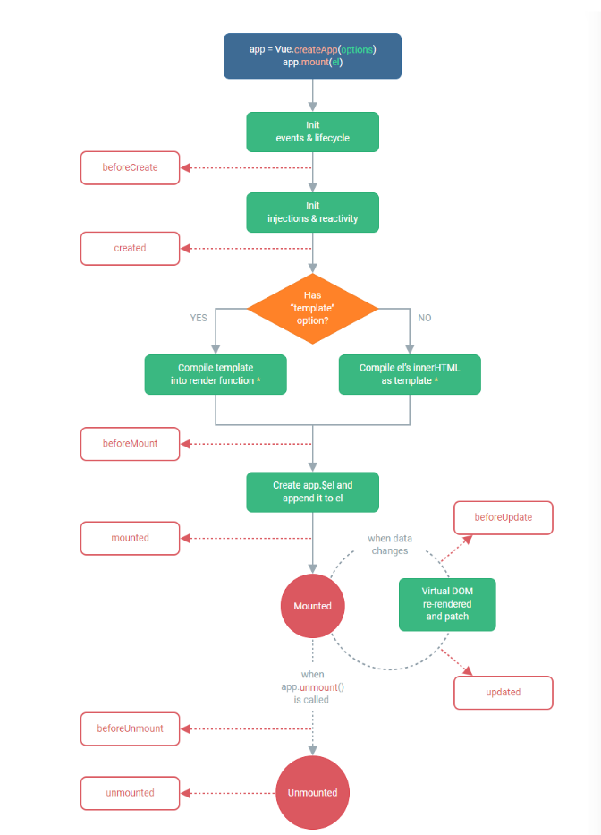

## 生命周期
```
/**
* 生命周期函数
*   创建期  beforeCreate  created
*   挂在期  beforeMount  mounted
*   更新期  beforeUpdate  updated
*   销毁期  beforeUnmount unmounted
*/

```

## 生命周期应用
- 模拟网络请求,至少要在created之后才给数据
- 先渲染数据重要还是先获取数据重要
- 答案是先渲染数据再获取数据,结构更重要(类似淘宝网下拉先给结构,再给数据)
## 动态组件
看componentA和componentB
## 组件保持存活
当使用`<component is=".."`来在多个组件间作切换时，被切换掉的组件会被卸载。

我们可以通过<keepalve>组件强制被切换掉的组件仍然保持“存活"的状态
## 异步组件
在大型项目中，我们可能需要拆分应用为更小的块，并仅在需要时再从服务器加载相关组件。Vue提供了defineAsyncComponent方法来实现此功能
