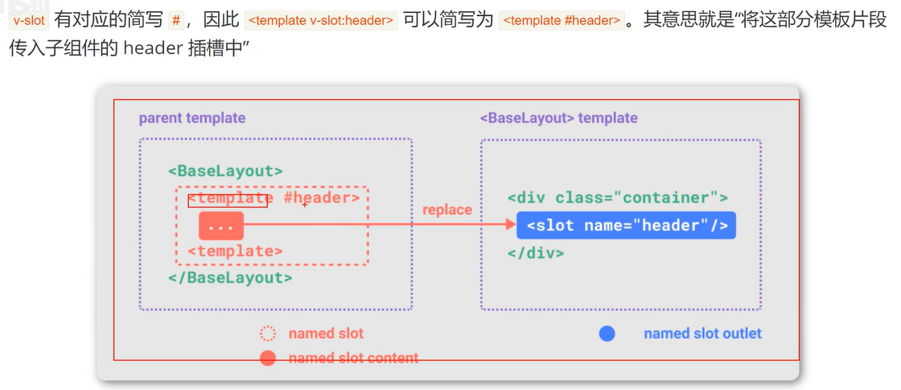

## 插槽slot使用
`<slot></slot>`是父模板HTMl的出口，在子模板中使用
父模板的内容会被渲染到子模板中
下面伪代码中的child会被放到`<slot></slot>`中
```
<parent>
    <child>
</parent>
```
## slot作用域范围

插槽内容可以访问到父组件的数据作用域，因为插槽内容本身是在父组件模板中定义的
## 默认内容
```
<slot>没有传递插槽值，那么这里面的内容就是插槽默认值</slot>
```
## 使用作用域
写一个`<template></template>`块，加上`v-slot:作用域名称`
在子模板中使用，只需要在slot后面加上 `name="作用域名称"即可`
## 简写
用
## 同时使用父组件域内和子组件域内的数据
在某些场景下插槽的内容可能想要同时使用父组件域内和子组件域内的数据。要做到这一点，我们需要一种方法来让子组件在渲染时将一部分数据提供给插槽

我们也确实有办法这么做!可以像对组件传递props那样，向一个插槽的出口上传递attributes
## 具名插槽
